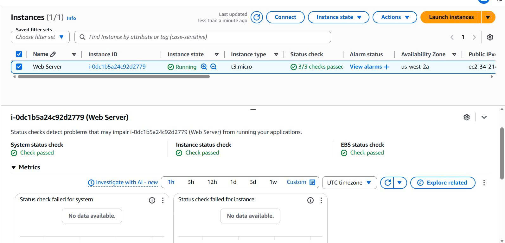
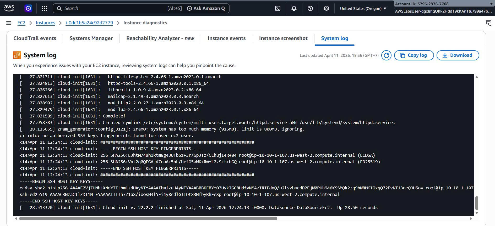
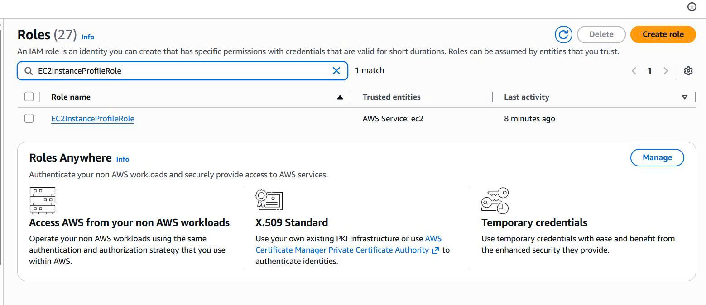
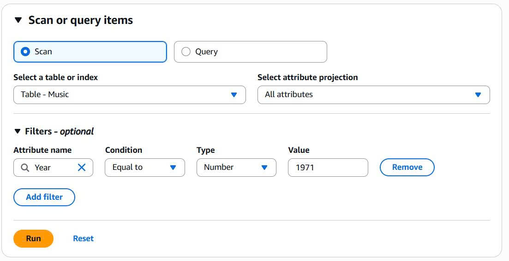
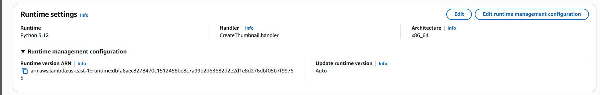
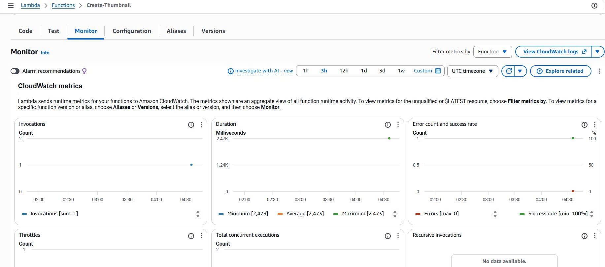

                                INTRODUCTION TO AMAZON EC2
Task 1: Launch Your Amazon EC2 Instance
- Ở AWS Management Console, tìm kiếm và chọn EC2
- Chọn Launch instance để khởi tạo 
- Name and tags: Đặt tên là Web Server
- Application and OS Images (AMI): Chọn Amazon Linux 2023 AMI (Chọn Hệ điều hành)
- Instance type: Chọn t3.micro (2 vCPU và 1 GiB Memmory) (Cấu hình RAM/CPU)
- Key pair -> Proceed without a key pair
- Network settings -> Edit (để thiết lập VPC)
- Chọn VPC có tên Lab VPC
- Subnet -> Chọn Public Subnet 1
- Firewall (Security Groups): Chọn Select existing security group -> Web Server security group (Chọn áp dụng một bộ quy tắc bảo mật đã có sẵn)
- Click vào Advanced details, tìm Termination protection -> Enable (Tạo 1 chôt an toàn khi lỡ như xóa máy chủ)
- User data dán đoạn script đã được cung cấp: 
#!/bin/bash
dnf -y install httpd
systemctl enable httpd
systemctl start httpd
echo '<html><h1>Hello From Your Web Server!</h1></html>' > /var/www/html/index.html

Task 2: Monitor Your Instance
- Status and alarms: Kiểm tra tính sẵn sàng của hệ thống (System/Instance/EBS reachability).

- Monitoring : Xem các biểu đồ CloudWatch (CPU, Network, Disk)
- Actions -> Monitor and troubleshoot -> Get system log (Dùng để kiểm tra quá trình khởi động và xác nhận script User Data đã chạy thành công)

- Actions -> Monitor and troubleshoot -> Get instance screenshot (Xem hình ảnh thực tế của màn hình console máy chủ)

Task 3: Update Your Security Group and Access the Web Server
- Cập nhật Security Group:
+ Truy cập mục Security Groups ở Phần Network & Security
+ Chọn Web Server security group

+ Tại tab Inbound rules, chọn Edit inbound rules
+ Thêm rule mới: Type HTTP, Source Anywhere-IPv4 (0.0.0.0/0) -> Save rules

- Thử truy cập: Copy Public IPv4 address của instance và dán vào trình duyệt với tiền tố http:// 

Task 4: Resize Your Instance (Type & EBS Volume)
- Stop Instance: Chọn Web Server -> Instance state -> Stop instance (Bắt buộc phải dừng máy chủ trước khi đổi loại instance)

- Actions -> Instance settings -> Change instance type (Đổi cấu hình Instance)
- Chọn t3.small và nhấn Change

- Thay đổi kích thước ổ đĩa (EBS Volume) -> mục Volumes (phần Elastic Block Store)
- Chọn Volume đang gắn vào Web Server -> Actions -> Modify volume
- Thay đổi Size từ 8 GiB thành 10 GiB. Nhấn Modify

- Quay lại mục Instances, chọn Web Server -> Instance state -> Start instance
Task 5: Test Termination Protection
- Chọn Web Server > Instance state > Terminate instance (thử xóa)

- Actions > Instance settings > Change termination protection. Bỏ chọn Enable và Save (Tắt bảo vệ)
- Web Server -> Instance state -> Terminate instance => Trạng thái chuyển sang Terminated

                                Storage Service (S3)
Task 1: Create a Bucket
- Copy Account ID
- Ở AWS Management Console, tìm kiếm và chọn S3 -> Create bucket
- Đặt tên Bucket (reportbucket-ID)
- Object Ownership -> ACLs enabled kích hoạt tính năng phân quyền Access Control List giup cấp quyền cho các file riêng 

Task 2: Upload an Object 
- Upload file -> Chọn new-report.png (Để đưa dữ liệu thực tế lên Cloud)

Task 3: Make an Object Public
- Truy cập Object URL -> Bị Access Denied (cơ chế bảo mật mặc định của AWS -> Phải có sự cho phép phân quyền)

- Deselect "Block all public access" (Mở "khóa tổng" của Bucket - Nếu khóa này vẫn bật,không thể làm bất kỳ file nào bên trong trở nên công khai)

- Make public using ACL -> Để cấp quyền "Read" cho mọi người trên Internet đối với file ảnh cụ thể
Task 4: Test Connectivity từ EC2
- Vào EC2 -> Chọn Bastion Host -> Connect (dùng Session Manager)
- Gõ lệnh aws s3 ls (Kiểm tra xem máy chủ đã có quyền liệt kê các bucket trong tài khoản chưa)
- Gõ lệnh aws s3 cp report-test1.txt s3://<tên-bucket> -> Lỗi (Không có quyền Ghi dữ liệu vòa bucket)
Task 5: Create a Bucket Policy
- Vào IAM -> Roles -> Tìm và copy ARN của EC2InstanceProfileRole

- Mở AWS Policy Generator -> Type: S3 Bucket Policy -> Effect: Allow -> Principal: (Dán Role ARN) -> Actions: GetObject, PutObject ->  Add Statement -> Generate Policy
- nó sẽ ra JSON format, hãy thêm /* ở Resource -> như thế này: 
{
    "Version": "2012-10-17",
    "Id": "Policy1604361694227",
    "Statement": [
        {
            "Sid": "Stmt1604361692117",
            "Effect": "Allow",
            "Principal": {
                "AWS": "arn:aws:iam::416159072693:role/EC2InstanceProfileRole"
            },
            "Action": [
                "s3:GetObject",
                "s3:PutObject"
            ],
            "Resource": "arn:aws:s3:::reportbucket987987/*"
        }
    ]
}
-> Copy JSON format -> Save changes
- Dán Policy JSON format đã copy vào phần "Bucket Policy" trong tab Permissions
Task 6: Explore Versioning
- Properties tab -> Bucket Versioning -> Edit -> Enable (Bật tính năng lưu lại lịch sử. Kể từ giờ, mỗi khi bạn sửa hay xóa file, bản cũ vẫn được AWS giữ lại)
- Upload đè file sample-file.txt mới
- nút "Show versions" (Để nhìn thấy tất cả các phiên bản (Version ID) của cùng một file)
- Tắt nút Show versions -> xóa file -> file không bị xóa chỉ hiện Delete Marker (S3 không xóa file thật mà chỉ dán một cái nhãn "đã xóa" lên trên cùng để ẩn file đi)
- Xóa nhãn "Delete Marker" (Phục hồi (Restore) file về trạng thái trước khi xóa)

                                AMAZON CLOUDFRONT
Task 1: Creating an S3 bucket and storing an image file
- Ở AWS Management Console, tìm kiếm và chọn S3 -> Create bucket
- Bucket name -> nhập cftan2907
- setting còn lại để default -> Create Bucket

- Upload file -> Ảnh .png vừa tải về máy -> Upload

- Chọn object mình vừa upload -> Copy URL -> dán vào 1 tab trình duyệt mới -> Lỗi Access Denied (Chưa có quyền truy cập)

Task 2: Creating a CloudFront web distribution
- Search "CloudFront" -> Create distribution  -> Chọn plan Pay as you go (Dùng bao nhiêu trả bấy nhiêu) -> Next
- Distribution name -> Nhập cloudfront-lab-distribution -> Next
- Origin type -> Amazon S3
- S3 origin -> Browse S3 -> Chọn bucket S3 mà mình vừa tạo -> Còn lại để default -> Next

- Web Application Firewall (WAF) -> Do not enable security protections -> Next -> Create distribution

Task 3: Testing the distribution
- Copy Distribution domain name ở Distribution vừa tạo
- Tạo 1 file myimage.html và copy nội dung đặt vào file đó: 
<html>
<head>My CloudFront Test</head>
<body>

My text content goes here.

</body>
</html>
- Thay DOMAIN = Distribution domain name bạn vừa copy ()
- Thay OBJECT = Tên file mà bạn vừa upload lên bucket S3 vừa tạo -> nội dung sau khi replace thì sẽ như thế này:
<html>
<head>My CloudFront Test</head>
<body>

My text content goes here.

</body>
</html>

- Mở file HTML bằng trình duyệt file bạn vừa mới tạo và chỉnh sửa 

=> Hiển thị thành công hình ảnh

                                AMAZON DYNAMODB
Task 1: Create a New Table
- Search "DynamoDB" -> Create table (Tiến hành tạo)
- Table name -> Music ,Partition key -> Artist (String) ,Sort key - optional -> Song (String)

Task 2: Add Data
- Click Explore table items -> Create item và nhập data:
+ Artist Value: Pink Floyd
+ Song Value : Money
- Click Add new attribute -> String -> Đặt Atribute name : Album , Value: The Dark Side of the Moon
- Tương tự tạo 1 Attribute mới -> Number -> Name: Year , Value: 1973
-> Create item
- Tương tự tạo thêm 1 item thứ 2:
1.Artist : John Lennon (String)
2.Song : Imagine(String)
3.Album: Imagine(String)
4.Year: 1971(Number)
5.Genre: Soft rock (String)
- Tương tự tạo thêm 1 item thứ 3:
1.Artist : Psy (String)
2.Song : Gangnam Style(String)
3.Album: Psy 6 (Six Rules), Part 1(String)
4.Year: 2011(Number)
5.LengthSeconds: 219 (Number)

Task 3: Modify an Existing Item
- Tick vào item Psy -> Action -> Edit item -> Đổi Year 2011 thành 2012
Task 4: Query the Table
- Chon Music table -> Chọn Query
- Partition key : Psy , Sort key - optional: Gangnam Style -> Run (tìm kiếm dựa trên Primary Key nên tốc độ cực nhanh và cực kỳ tiết kiệm chi phí)

- Chọn Scan -> Filters - optinal -> Nhập Attribute name: Year ,Type: Number, Condition: Equal To, Value: 1971 -> Run (đọc tất cả các Item trong bảng rồi mới lọc kết quả)

Task 5: Delete the Table
- Chọn table Music -> Delete -> Nhập confirm -> Delete

                                AWS Lambda
Task 1: Create Amazon S3 Buckets
- tạo 2 bucket S3 với tên là images-29072004 và images-29072004-resized (1 bucket đầu vào và 1 bucket đầu ra)
- Tải file HappyFace.jpg và upload vào bucket images-29072004

Task 2: Create an AWS Lambda function
- Search Lambda -> Create function
- Function name: Create-Thumbnail, Runtime: Python 3.12
- Click Change default execution role -> Use another role (Execution role) -> chọn lambda-execution-role
- Click Additional configurations -> tick chọn VPC -> Chọn VPC với CIDR range 10.0.0.0/16 -> Subnets (CIDR range 10.0.1.0/24) -> Security groups ( LambdaSecurityGroup)

- Đã tạo xong 

- Chọn Add trigger -> Chọn S3 -> Bucket: chọn bucket đầu vào (images-29072004)
- Event types -> All object create events
- Recursive invocation -> tick I acknowledge -> Add

- Chọn code tab -> Upload from -> Amazon S3 location

- Copy và dán Amazon S3 link URL mà bài lap đã cung cấp -> Save
- kéo xuống Runtime settings -> Edit -> đổi tên Handler thành CreateThumbnail.handler

- Click vào Configuration tab -> General configuration -> Edit
- Mục Description - optional -> Create a thumbnail-sized image

Task 3: Test your function
- Chọn Test tab -> Create new event
-  Event name: Upload, Template - optional: S3 Put => Event JSON sẽ được gen ra 
- Thay phần example-bucket trong name ở S3 ở trong Event JSon = tên bucket đầu vào (images-29072004)
- Tương tự thay  test%2Fkey ở phần key = HappyFace.jpg (bạn đã upload ở S3)
- EVENT JSON sẽ trở thành giống như sau: 
{
  "Records": [
    {
      "eventVersion": "2.0",
      "eventSource": "aws:s3",
      "awsRegion": "us-east-1",
      "eventTime": "1970-01-01T00:00:00.000Z",
      "eventName": "ObjectCreated:Put",
      "userIdentity": {
        "principalId": "EXAMPLE"
      },
      "requestParameters": {
        "sourceIPAddress": "127.0.0.1"
      },
      "responseElements": {
        "x-amz-request-id": "EXAMPLE123456789",
        "x-amz-id-2": "EXAMPLE123/5678abcdefghijklambdaisawesome/mnopqrstuvwxyzABCDEFGH"
      },
      "s3": {
        "s3SchemaVersion": "1.0",
        "configurationId": "testConfigRule",
        "bucket": {
          "name": "images-29072004", (Bucket đầu vào nhé ae)
          "ownerIdentity": {
            "principalId": "EXAMPLE"
          },
          "arn": "arn:aws:s3:::example-bucket"
        },
        "object": {
          "key": "HappyFace.jpg", (Thay ảnh đã upload S3 ở đây)
          "size": 1024,
          "eTag": "0123456789abcdef0123456789abcdef",
          "sequencer": "0A1B2C3D4E5F678901"
        }
      }
    }
  ]
}
=> Click Test

- Chọn Details ở mục Executing function: succeeded khi đã chạy test -> Sẽ show: 
+ Execution time
+ Resources configured
+ Maximum memory used
+ Log output

- Search S3 -> Chọn bucket đầu ra (images-29072004-resized)
- Chọn HappyFace.jpg -> Open => Bức ảnh đã được resized
- Ảnh ở bucket đầu vào :

- Ảnh bucket đầu ra :

Task 4: Monitoring and logging
- Search Lambda -> Chọn function đã tạo (Create-Thumbnail) -> Chọn Monitor tab
-> Console sẽ display:
+ Invocations: Số lần hàm được gọi
+ Duration: Thời gian thực hiện trung bình, tối thiểu và tối đa
+ Error count and success rate (%): Số lượng lỗi và tỷ lệ phần trăm thực thi đã hoàn thành mà không có lỗi
+ Throttles: Khi quá nhiều chức năng được gọi đồng thời, chúng sẽ bị điều tiết. Mặc định là 1000 lần thực thi đồng thời
+ Async delivery failures: Số lượng lỗi xảy ra khi Lambda cố gắng ghi đến đích hoặc hàng đợi thư chết
+ Iterator Age: Đo lường tuổi của bản ghi cuối cùng được xử lý từ trình kích hoạt phát trực tuyến (Amazon Kinesis và Amazon DynamoDB Streams)
+ Total concurrent executions: Số lượng thực thể hàm đang xử lý sự kiện

- Click View CloudWatch logs -> kéo xuống Log Stream -> Click vào link => hiện ra Log events

                                Amazon API Gateway
Task 1: Create a Lambda Function
- Vào Lambda tạo 1 function:
+ Chọn Author from scratch
+ Function name: FAQ
+ Runtime: Node.js 22.x
+ Change default execution role -> Use another role -> lambda-basic-execution
+ Additional configurations chọn như sau:

-> Create function

- Vào Code tab, nháy vào index.js file -> xóa nội dung đang có và dán vào nội dung này:
var json = {
  "service": "lambda",
  "reference": "https://aws.amazon.com/lambda/faqs/",
  "questions": [{
    "q": "What is AWS Lambda?",
    "a": "AWS Lambda lets you run code without provisioning or managing servers. You pay only for the compute time you consume - there is no charge when your code is not running. With Lambda, you can run code for virtually any type of application or backend service - all with zero administration. Just upload your code and Lambda takes care of everything required to run and scale your code with high availability. You can set up your code to automatically trigger from other AWS services or call it directly from any web or mobile app."
  },{
   "q":"What events can trigger an AWS Lambda function?",
   "a":"You can use AWS Lambda to respond to table updates in Amazon DynamoDB, modifications to objects in Amazon S3 buckets, logs arriving in Amazon CloudWatch logs, incoming emails to Amazon Simple Email Service, notifications sent from Amazon SNS, messages arriving in an Amazon Kinesis stream, client data synchronization events in Amazon Cognito, and custom events from mobile applications, web applications, or other web services. You can also invoke a Lambda function on a defined schedule using the AWS Lambda console."
  },{
   "q":"When should I use AWS Lambda versus Amazon EC2?",
   "a":"Amazon Web Services offers a set of compute services to meet a range of needs. Amazon EC2 offers flexibility, with a wide range of instance types and the option to customize the operating system, network and security settings, and the entire software stack, allowing you to easily move existing applications to the cloud. With Amazon EC2 you are responsible for provisioning capacity, monitoring fleet health and performance, and designing for fault tolerance and scalability. AWS Elastic Beanstalk offers an easy-to-use service for deploying and scaling web applications in which you retain ownership and full control over the underlying EC2 instances. Amazon Elastic Container Service is a scalable management service that supports Docker containers and allows you to easily run distributed applications on a managed cluster of Amazon EC2 instances. AWS Lambda makes it easy to execute code in response to events, such as changes to Amazon S3 buckets, updates to an Amazon DynamoDB table, or custom events generated by your applications or devices. With Lambda you do not have to provision your own instances; Lambda performs all the operational and administrative activities on your behalf, including capacity provisioning, monitoring fleet health, applying security patches to the underlying compute resources, deploying your code, running a web service front end, and monitoring and logging your code. AWS Lambda provides easy scaling and high availability to your code without additional effort on your part."
  },{
    "q":"What kind of code can run on AWS Lambda?",
    "a":"AWS Lambda offers an easy way to accomplish many activities in the cloud. For example, you can use AWS Lambda to build mobile back-ends that retrieve and transform data from Amazon DynamoDB, handlers that compress or transform objects as they are uploaded to Amazon S3, auditing and reporting of API calls made to any Amazon Web Service, and server-less processing of streaming data using Amazon Kinesis."
  },{
    "q":"What languages does AWS Lambda support?",
    "a":"AWS Lambda supports code written in Node.js (JavaScript), Python, and Java (Java 8 compatible). Your code can include existing libraries, even native ones. Lambda functions can easily launch processes using languages supported by Amazon Linux, including Bash, Go, and Ruby. Please read our documentation on using Node.js, Python and Java."
  },{
    "q":"Can I access the infrastructure that AWS Lambda runs on?",
    "a":"No. AWS Lambda operates the compute infrastructure on your behalf, allowing it to perform health checks, apply security patches, and do other routine maintenance."
  },{
    "q":"How does AWS Lambda isolate my code?",
    "a":"Each AWS Lambda function runs in its own isolated environment, with its own resources and file system view. AWS Lambda uses the same techniques as Amazon EC2 to provide security and separation at the infrastructure and execution levels."
  },{
    "q":"How does AWS Lambda secure my code?",
    "a":"AWS Lambda stores code in Amazon S3 and encrypts it at rest. AWS Lambda performs additional integrity checks while your code is in use."
  },{
    "q":"What is an AWS Lambda function?",
    "a":"The code you run on AWS Lambda is uploaded as a Lambda function. Each function has associated configuration information, such as its name, description, entry point, and resource requirements. The code must be written in a stateless style i.e. it should assume there is no affinity to the underlying compute infrastructure. Local file system access, child processes, and similar artifacts may not extend beyond the lifetime of the request, and any persistent state should be stored in Amazon S3, Amazon DynamoDB, or another Internet-available storage service. Lambda functions can include libraries, even native ones."
  },{
    "q":"Will AWS Lambda reuse function instances?",
    "a":"To improve performance, AWS Lambda may choose to retain an instance of your function and reuse it to serve a subsequent request, rather than creating a new copy. Your code should not assume that this will always happen."
  },{
    "q":"What if I need scratch space on disk for my AWS Lambda function?",
    "a":"Each Lambda function receives 500MB of non-persistent disk space in its own /tmp directory."
  },{
    "q":"Why must AWS Lambda functions be stateless?",
    "a":"Keeping functions stateless enables AWS Lambda to rapidly launch as many copies of the function as needed to scale to the rate of incoming events. While AWS Lambda's programming model is stateless, your code can access stateful data by calling other web services, such as Amazon S3 or Amazon DynamoDB."
  },{
    "q":"Can I use threads and processes in my AWS Lambda function code?",
    "a":"Yes. AWS Lambda allows you to use normal language and operating system features, such as creating additional threads and processes. Resources allocated to the Lambda function, including memory, execution time, disk, and network use, must be shared among all the threads/processes it uses. You can launch processes using any language supported by Amazon Linux."
  },{
    "q":"What restrictions apply to AWS Lambda function code?",
    "a":"Lambda attempts to impose few restrictions on normal language and operating system activities, but there are a few activities that are disabled: Inbound network connections are managed by AWS Lambda, only TCP/IP sockets are supported, and ptrace (debugging) system calls are restricted. TCP port 25 traffic is also restricted as an anti-spam measure."
  },{
    "q":"How do I create an AWS Lambda function using the Lambda console?",
    "a":"You can author the code for your function using the inline editor in the AWS Lambda console. You can also package the code (and any dependent libraries) as a ZIP and upload it using the AWS Lambda console from your local environment or specify an Amazon S3 location where the ZIP file is located. Uploads must be no larger than 50MB (compressed). You can use the AWS Eclipse plugin to author and deploy Lambda functions in Java and Node.js. If you are using Node.js, you can author the code for your function using the inline editor in the AWS Lambda console. Go to the console to get started."
  },{
    "q":"How do I create an AWS Lambda function using the Lambda CLI?",
    "a":"You can package the code (and any dependent libraries) as a ZIP and upload it using the AWS CLI from your local environment, or specify an Amazon S3 location where the ZIP file is located. Uploads must be no larger than 50MB (compressed). Visit the Lambda Getting Started guide to get started."
  },{
    "q":"Which versions of Python are supported?",
    "a":"Lambda provides a Python 2.7-compatible runtime to execute your Lambda functions. Lambda will include the latest AWS SDK for Python (boto3) by default."
  },{
    "q":"How do I compile my AWS Lambda function Java code?",
    "a":"You can use standard tools like Maven or Gradle to compile your Lambda function. Your build process should mimic the same build process you would use to compile any Java code that depends on the AWS SDK. Run your Java compiler tool on your source files and include the AWS SDK 1.9 or later with transitive dependencies on your classpath. For more details, see our documentation."
  },{
    "q":"What is the JVM environment Lambda uses for execution of my function?",
    "a":"Lambda provides the Amazon Linux build of openjdk 1.8."
  }
  ]
}

export const handler = function(event, context) {
    var rand = Math.floor(Math.random() * json.questions.length);
    console.log("Quote selected: ", rand);

    var response = {
        body: JSON.stringify(json.questions[rand])
    };
    console.log(response);
    context.succeed(response);
};

-> Chọn deploy 
- Create an API Gateway endpoint:
+ Vào Configuration tab -> General configuration -> Edit -> Description: Provide a random FAQ -> Save
+ Add trigger -> Chọn API Gateway -> Create a new API -> API type: REST API -> Security: Open
+ Click vào Additional settings -> Deployment stage: myDeployment

-> Add

Task 2: Test the Lambda function
- Ở Configuration tab -> Triggers tab -> Click vào Details ở Trigger API Gateway vừa mới tạo
- Copy API endpoint vào trình duyệt mới

- Vào Test tab -> Event name: BasicTest -> Xóa Value ở Event JSON chỉ chừa lại {} 
-> Test
- Vào details function khi test xong:

- Vào Monitor tab -> View CloudWatch logs -> Log streams -> Click vào link là xem được Log event

------------------------------Đã Xong 6 bài Lab rồi nhé AE <3 ------------------------------